### Use: ExpressJS, NodeJS, MongoDB
### Project Parts

Here's an image of how use user name as Unique identifier and If usser.js work get result 200:

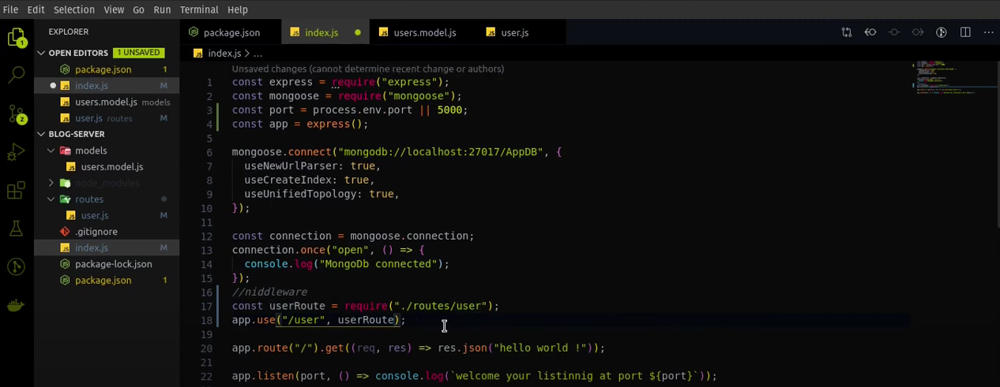

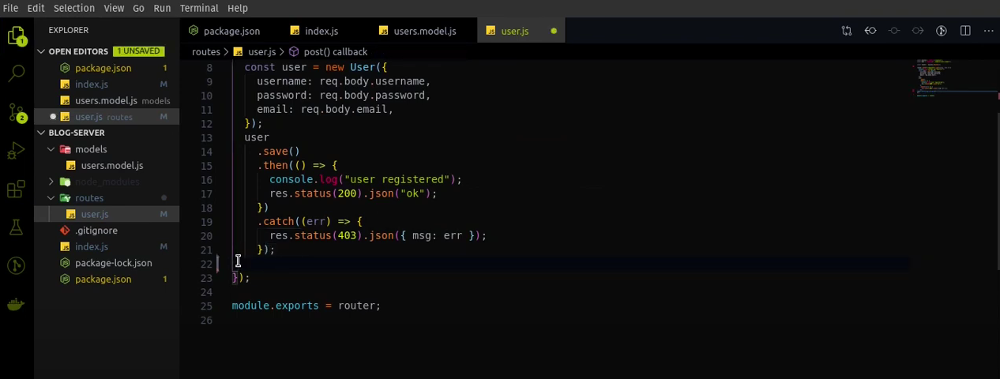

### Working account create
After http://LocalHost:5000/user/everyEndPoint ---> go insaid user.js Method: Post can see JS as a type
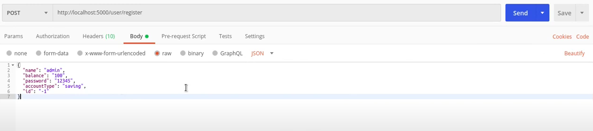

### MongoDB
Start MongoDB
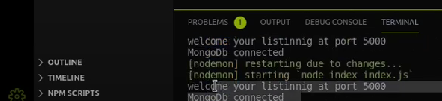

Will Decode a JS date

User same was add and to MongoDB
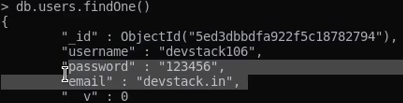

### Password change
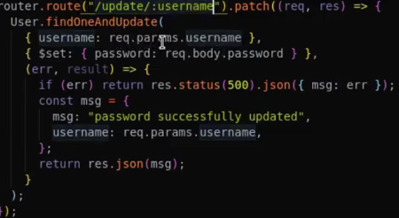
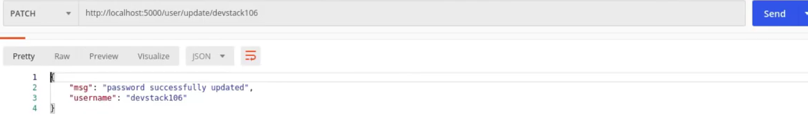
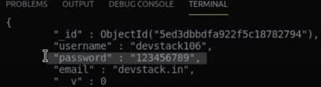

### Delete user
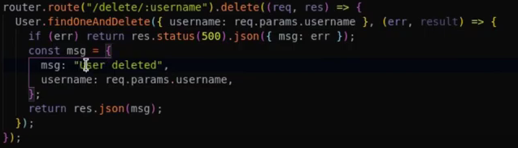
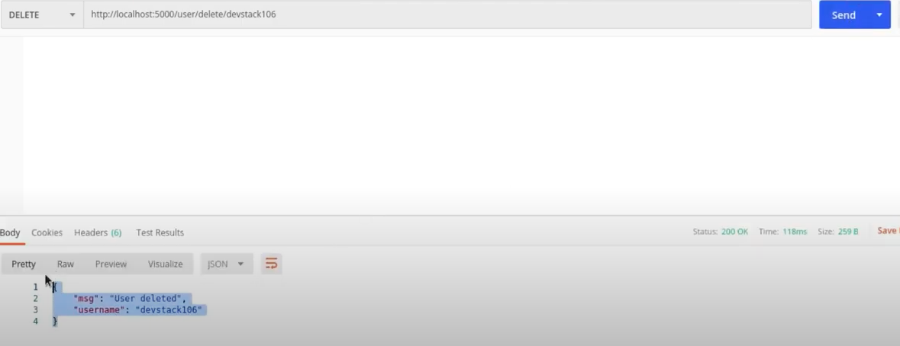
Delete and from DB
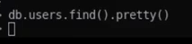

### Use tokins for security
Add middleware to delete and passChange for validation with tokens.
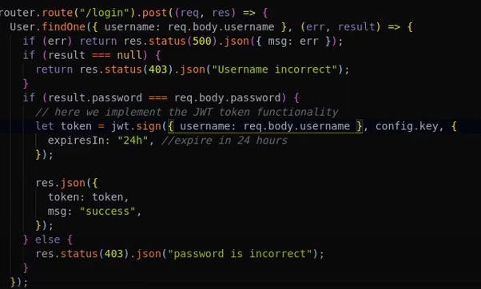
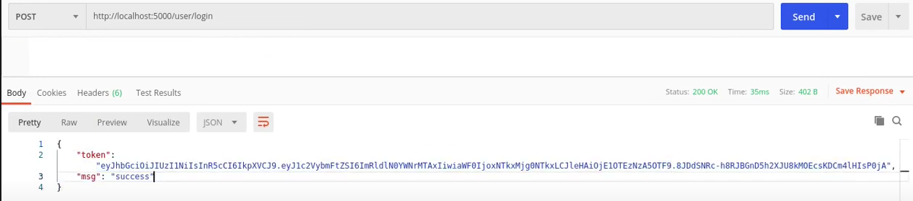

### About post something can faind in fail: blogpost.js :)
